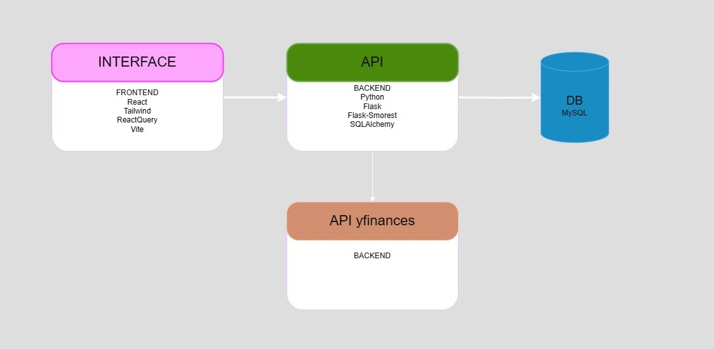

HEAD
# mvpApiFrontend
# Financas Frontend 
Uma aplicação fullstack para gerenciamento de contas bancárias, ações e transações financeiras. O sistema permite criar usuários, registrar ações de mercado e registrar transações que conectam contas com ações específicas, incluindo o cálculo de conversão e exibição de preços atualizados.

## Tecnologias utilizadas
- **frontend**: React, TailwindCss, React Query, Vite
- **backend**: Pythong, Flask, Flask-smorest, Flask-CORS, SQLAlchemy
- **DB**: MySQL

## Instalacoes
### Requisitos
- Node.js
- Python 3.10+
- Docker
- Git

### Instalacao Docker
#### Backend
 ``` cd backend ```
``` docker build -t finances-backend . ``` 
``` docker run -p 5000:5000 finances-backend  ``` 

#### frontend
 ``` cd frontend/frontend-finances ```
``` docker build -t frontend-img . ``` 
``` docker run -p 5173:5173 frontend-img  ``` 

## Fluxogram



This template provides a minimal setup to get React working in Vite with HMR and some ESLint rules.

Currently, two official plugins are available:

- [@vitejs/plugin-react](https://github.com/vitejs/vite-plugin-react/blob/main/packages/plugin-react/README.md) uses [Babel](https://babeljs.io/) for Fast Refresh
- [@vitejs/plugin-react-swc](https://github.com/vitejs/vite-plugin-react-swc) uses [SWC](https://swc.rs/) for Fast Refresh

## Expanding the ESLint configuration

If you are developing a production application, we recommend using TypeScript and enable type-aware lint rules. Check out the [TS template](https://github.com/vitejs/vite/tree/main/packages/create-vite/template-react-ts) to integrate TypeScript and [`typescript-eslint`](https://typescript-eslint.io) in your project.
 ae2cad8 (First commit frontEnd API)
